# 👋 Hi, I'm Arpan ([@arpanbasak90-cyber](https://github.com/arpanbasak90-cyber))

### Full-Stack Builder | Web3 (Stellar/Soroban) | AI & Healthtech | Game Dev

I'm a CS student at **Narula Institute of Technology, Kolkata** who builds fast under hackathon pressure. My work spans **Web3 on Stellar**, **AI-driven healthtech**, and **browser/Unity game development**.

---

## 📊 GitHub Stats

---

## 🚀 Featured Projects & Repositories

### 🌟 [BuilderLeaderboard Platform](https://builder-leaderboard-platform.vercel.app)
**Gamified Stellar Ecosystem Leaderboard** — A Next.js + Tailwind platform that gamifies builder activity across the Stellar ecosystem. Features real Freighter wallet integration, multi-wallet support, and a live **Soroban smart contract** deployed on Stellar Testnet.

`Tech Stack: Next.js, Tailwind CSS, Rust, Soroban, Stellar`

### 💳 [KREDZ](https://github.com/arpanbasak90-cyber/KREDZ)
**AI-Powered Credit Intelligence Platform** — A full-stack app using AI-driven logic to analyze, verify, and score creditworthiness in real time. FastAPI backend, React + Tailwind frontend, Dockerized and deployed across Vercel + Render. Built as a team project.
🔗 [Live Demo](https://kredz-2nzq.vercel.app) · [API Docs](https://kredz.onrender.com/docs)

`Tech Stack: React, Tailwind CSS, FastAPI, Python, Docker`

### 🖼️ [NFT Minting Platform](https://github.com/arpanbasak90-cyber/NFT-Minting-Platform)
**Soroban-Powered NFT Platform on Stellar** — A foundational NFT minting platform where users can create, own, transfer, and query unique digital assets on-chain, built entirely with Soroban smart contracts.
🔗 [View Deployed Contract](https://stellar.expert/explorer/testnet/contract/CDVCJKX6FJFOOQ76BJ365SJS6OTGH2ZQF6QVJO5YGGR37QBJ3I2QB7PZ)

`Tech Stack: Rust, Soroban, Stellar`

### 🚑 MedFlow Routing
**AI-Powered Emergency Response & Smart Ambulance Routing System** — A FastAPI backend running three ML models (Random Forest / Gradient Boosting) to classify heart, stroke, and respiratory emergencies from patient vitals at ~98–100% accuracy, paired with real-time route optimization. Built for **TECHNOVA 2026**.

`Tech Stack: FastAPI, Python, scikit-learn, React, OpenRouteService`

### 🏛️ Dharohar
**Culture & Heritage Discovery Platform** — An interactive portal featuring a clickable India map, regional festival calendars, and an AI chatbot for exploring India's cultural heritage.

`Tech Stack: Next.js, AI Integration`

### 🎮 Browser & Unity Games
- **Arpan's Run** — HTML5 canvas endless runner with parallax scrolling
- **Military FPS** — Single-player browser FPS built with Three.js, featuring AI bots and multiple weapons
- **Battle Royale Prototype** — Low-poly mobile battle royale built in Unity (C#, URP) with offline bots and joystick controls

`Tech Stack: Three.js, Canvas API, Unity, C#`

### 🧬 [Mintlify Clone](https://mintlify-clone-lilac.vercel.app)
Pixel-perfect replica of the Mintlify homepage, built and deployed under deadline pressure.

`Tech Stack: TypeScript, TanStack Start`

---

## 🛠️ Languages & Technologies

**Web3 & Blockchain:** Stellar, Soroban Smart Contracts, Freighter Wallet
**Backend & AI/ML:** FastAPI, Supabase, scikit-learn

---

## 📫 Let's Connect!

---

## 📈 GitHub Metrics Dashboard

<i>"Building under deadlines, shipping under pressure — hackathons are just my favorite sprint."</i>

